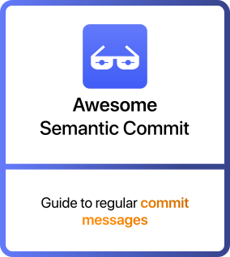

<p align="center">
   
</p>

<p align="center">
   
   
   
   
   <br />
   
   
   
   <br />
   
   <a href="README_TR.md">
      
   </a>
</p>

<p align="center">
  <a href="https://semanticcommit.com?utm_source=github&utm_medium=website-text&utm_campaign=analysis">Website</a>
  ·
  <a href="https://semanticcommit.com/commit-generator?utm_source=github&utm_medium=commit-generator-text&utm_campaign=analysis">Commit Generator</a>
  ·
  <a href="https://twitter.com/yusufbozaci_">Follow on Twitter</a>
  <br />
  <a href="README_APP.md">App Documentation for Developers</a>
</p>

# Awesome Semantic Commit [](https://awesome.re)

> Guide to regular commit messages

Semantic Commit is a method used in software development. Its main purpose is to ensure that commit messages (i.e., messages associated with each change made to the code) are more meaningful and structured. This way, developers can more easily understand when, why, and what changes were made to the code.

## Contents

- [Why Is It Important](#why-is-it-important)
- [Commit Message Structure](#commit-message-structure)
- [How to Use](#how-to-use)
- [How to Not Use](#how-to-not-use)
- [Frequently Asked Questions](#frequently-asked-questions)
- [Contribute](#contribute)

## Why Is It Important

<b>Easily Understandable Changes</b><br />
Each commit message clearly describes the changes made. This way, while working on a project, you can quickly understand what changed in the code and why. For example, instead of saying 'just some edits made,' a clear explanation like 'new login page added' is provided.

<b>Faster Issue Resolution</b><br />
When there is a bug in a project, it becomes much easier to find the changes that might have caused the issue by reviewing past commit messages. Meaningful and structured commit messages help you quickly locate and resolve errors.

<b>Version Tracking</b><br />
Semantic Commit helps you see more clearly which changes were made in which version of the project. For example, when a new feature is added, the version number can be updated. This makes it easier to keep the project up to date.

<b>Team Collaboration</b><br />
When working with multiple people, having everyone write commit messages in the same way keeps the project organized. This way, one team member can more easily understand what another has done, increasing collaboration.

<b>Easier Project Management</b><br />
As the project grows, there may be hundreds or even thousands of commits. Meaningful commit messages make it easier to manage the large project and track changes over time.

## Commit Message Structure

Semantic Commit messages are written according to a specific rule. These rules make the structure of each commit message meaningful and consistent.

### 1. Type

This indicates the type of change made. It is added at the beginning of the commit message. Common commit types include:

- (feat): Used when a new feature is added.
- (fix): Indicates that a bug has been fixed.
- (docs): Used if only documentation-related changes are made.
- (style): Changes that do not affect the code's functionality, only related to formatting (e.g., correcting spaces or punctuation).
- (chore): Non-functional changes to the code or dependencies. For example, package updates or changes in build configurations.
- (refactor): Used to restructure the code without changing its functionality.
- (test): Used to add or update tests.
- (perf): Used for changes made solely to improve performance without altering functionality.
- (ci): Used for changes related to continuous integration configuration.
- (build): Used for changes related to the build system, such as build settings or dependency management.
- (revert): Reverts the effects of a previous commit.

### 2. Scope (Optional)

Specifies which module, file, or component the change was made on. It is written in parentheses along with the type.

Examples:

- feat(auth), fix(ui), docs(readme), style(header), chore(deps), refactor(api), test(login), perf(image-loader), ci(travis), build(webpack), revert(api)

### 3. Subject

Briefly and concisely describes what the commit does. It should be written in a maximum of 50 characters.

Examples:

- feat(auth): add login functionality
- fix(ui): resolve button alignment issue
- docs(readme): update installation instructions
- style(header): fix indentation
- chore(deps): update axios to v0.21.1
- refactor(api): optimize fetch method
- test(login): add unit tests for login function
- perf(image-loader): optimize image loading for faster page speed
- ci(travis): add deployment step to pipeline
- build(webpack): update webpack configuration for faster builds
- revert(api): revert API changes that caused issues with data fetching

## How to Use

This section explains how to implement and follow semantic commit message practices to ensure clarity in version control.

### 1. Staging Changes

First, after making changes to the files you're working on, you need to use the `git add` command in the terminal to include these files in the commit.

To add all files, enter the following command in the terminal:

```bash
git add .
```

If you only want to add specific files:

```bash
git add <file-name>
```

### 2. Making a Commit

To commit the changes, you can use the following command in the terminal:

```bash
git commit -m "<commit-message>"
```

When writing a commit message that follows the Semantic Commit rules, here are the key things to pay attention to:

- Commit Type: Indicate the type of change made (e.g., feat, fix, docs, etc.).
- Scope (Optional): You can use scope to specify which module or component was changed.
- Message Title: Briefly and concisely describe the change.

Example commit:

```bash
git commit -m "feat(auth): add user login functionality"
```

### 3. Pushing the Commit

After making a commit, you can push your changes to the remote repository using the following command in the terminal:

```bash
git push origin <branch-name>
```

For example, if you're pushing to the main or dev branch:

```bash
git push origin main
```

## How to Not Use

This outlines the common mistakes or misuses in commit messages, helping users avoid confusion or inconsistency.

### 1. Commit Messages Should Only Be in English

Why? English is considered a global language in the software world. Developers and teams from different countries communicate in English during coding and in commit messages. Therefore, commit messages should also be in English.

Commit messages written in Turkish or other languages can confuse people working in international teams or on open-source projects and make collaboration more difficult.

<b>❌ Wrong Usage</b><br />
`eklenen özellik`, `güncellenen sayfa`, `değiştirilen kod`
<br /><br />
<b>✅ Correct Usage</b><br />
`feat: add new search feature`, `fix: update login page`, `refactor: improve validation logic`

### 2. Why Should We Avoid Using Words Like 'added', 'updated', 'changed'

There is no need to use these words to indicate commit types, as the commit types already convey this meaning. Types like `feat`, `fix`, and `refactor` already specify the purpose of the changes, so there is no need to repeat words like 'added', 'updated', or 'changed'.

<b>❌ Wrong Usage</b><br />
`feat: added new button`, `fix: updated validation`, `refactor: changed structure`
<br /><br />
<b>✅ Correct Usage</b><br />
`feat: add new button`, `fix: improve validation logi`, `refactor: change component structure`

### 3. Incorrect Type Usage

Using an incorrect label in the commit message that does not match the type of change made. Each type serves a specific purpose, and incorrect type usage can make it unclear what the changes are for. This situation can make it difficult for the project team to track changes and complicate code management.

<b>❌ Wrong Usage</b><br />
`fix: add user authentication`, `feat: fix payment gateway issue`, `fix: optimize the code`
<br /><br />
<b>✅ Correct Usage</b><br />
`feat: add user authentication`, `fix: payment gateway issue`, `refactor: optimize the code`

### 4. Unnecessary Use of Capital Letters or Special Characters

The use of capital letters or special characters in commit messages, either accidentally or intentionally, that disrupts the readability and consistency of the messages. Such usage can cause commit messages to lose their professionalism and alignment with standards.

<b>❌ Wrong Usage</b><br />
`FEAT: NEW LOGIN SYSTEM IMPLEMENTED!!!`, `FIX: NULL POINTER EXCEPTION FIXED`, `REFACTOR: IMPROVED CODE PERFORMANCE!!!`
<br /><br />
<b>✅ Correct Usage</b><br />
`feat: implement new login system`, `fix: resolve null pointer exception`, `refactor: improve code performance`

## Frequently Asked Questions

### What are the benefits of using semantic commit messages

1. Understandability: Each commit message clearly states the purpose and reason for the change. For example, a message like "feat: Added new user login page" indicates that this commit was made to add a new feature.

2. Tracking the Code History: If a project has many developers working on it, each commit message makes the project's history more transparent and easier to track. Knowing when a change was made helps in finding and fixing bugs.

3. Versioning and Automation: Semantic commit messages can help with automatic version updates (e.g., adding a new feature, fixing a bug). These messages make it easier to increase version numbers in an organized way (e.g., 1.2.0 → 1.3.0).

### How to choose commit types

Each commit message should clearly express the purpose of the change. This helps other developers in the project to easily understand the reason for the changes. A good commit message avoids general terms like 'bug fix' or 'feature update' and clearly states what has been improved or fixed. Commit messages should also be concise. If necessary, additional explanations or references can be added after the commit message.

### Is the scope mandatory

No, the scope is not mandatory. It is optional and can be used to indicate which section or module is affected by the change. However, in large projects or projects with multiple modules, using the scope can clarify the affected area and make the message more meaningful.

### How do I undo a commit

There are several methods to undo a commit:

Undo the last commit (soft reset):

`git reset --soft HEAD~1`

- This command undoes the last commit but leaves the changes in your working directory.

Completely undo the last commit (hard reset):

`git reset --hard HEAD~1`

- This command deletes both the commit and the changes.

Undo using the git revert command:

`git revert`

- This command undoes a specific commit and creates a new commit.

### I didn't follow the rules, what should I do

You can undo the commit. Check the 'How do I undo a commit?' section for more detailed information.

### Should commit messages be in English

Yes, commit messages should be in English, as it is a global language. This increases the understandability for all developers in the project and facilitates international collaboration in open-source projects.

## Footnotes

Provides additional references or explanations for certain points discussed in the document.

### References

The following resources were used as a foundation, with additional insights and enhancements added along the way:

- [Semantic Git Commit Messages - Gist](https://gist.github.com/joshbuchea/6f47e86d2510bce28f8e7f42ae84c716)
- [Semantic Commit Messages - Medium](https://callmeryan.medium.com/semantic-commit-messages-bcd60f75de1f)

## Contribute

Contributions are welcome! Please see [CONTRIBUTING.md](CONTRIBUTING.md) for more information.
