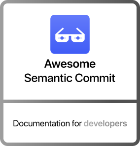
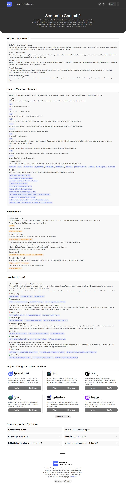
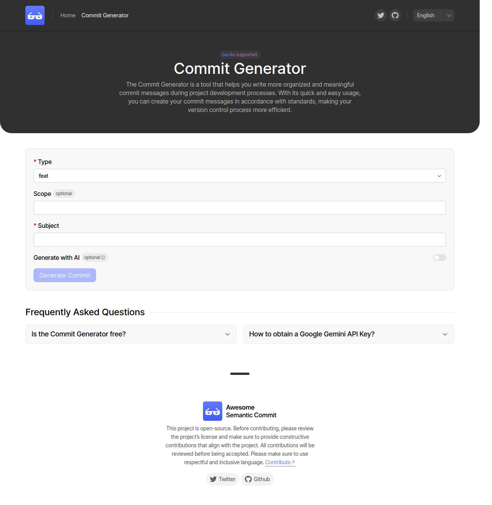

<p align="center">
   
</p>

<p align="center">
   
   
   
   
   <br />
   
   
   
</p>

<p align="center">
  <a href="https://semanticcommit.com?utm_source=github&utm_medium=website-text&utm_campaign=analysis">Website</a>
  ·
  <a href="https://semanticcommit.com/commit-generator?utm_source=github&utm_medium=commit-generator-text&utm_campaign=analysis">Commit Generator</a>
  ·
  <a href="https://twitter.com/yusufbozaci_">Follow Twitter</a>
  <br />
  <a href="README.md">General Documentation</a>
</p>

# Awesome Semantic Commit

This documentation contains information about the web application developed for [semanticcommit.com](https://semanticcommit.com). Detailed information about the requirements of the project, how to run it and the technologies used can be found here.

## Contents

- [About Project](#about-project)
- [Project Preview](#project-preview)
- [Project File Structure](#project-file-structure)
- [Requirements](#requirements)
- [Installation and Operation](#installation-and-operation)
- [Integrations](#integrations)
- [Localisation](#localisation)
- [Used Technologies/Tools](#used-technologiestools)
- [Contributing](#contributing)
- [License](#license)

## About Project

**Awesome Semantic Commit** is a web application developed to streamline commit messages, improve code readability, facilitate team collaboration and optimise version control processes. This application helps users to manage the versioning process in a more organised and efficient way by enabling them to follow certain rules for commit messages.

## Project Preview

### Home Page



### Commit Generator



You can check the project live [here](https://semanticccommit.com).

## Project File Structure

```
awesome-semantic-commit/
├── docs/                     # Documentation files
├── public/                   # Static assets (favicon, images, etc.)
├── src/                      # Source code of the project
│   ├── app/                  # Project pages (routes entry points)
│   ├── assets/               # Images, fonts, and other assets
│   ├── components/           # Reusable React components
│   │   ├── pages/            # Components specific to individual pages
│   │   ├── sections/         # Sections used within pages
│   │   ├── shared/           # Components shared across all pages
│   │   ├── ui/               # General UI components like buttons, inputs, etc.
│   ├── data/                 # Static data files
│   ├── i18n/                 # Functions for localization
│   ├── locales/              # Localization files (e.g., tr, en, etc.)
│   ├── modals/               # Modal components
│   │   ├── elements/         # Specific elements for modals (e.g., Add Project)
│   │   ├── utils/            # Utility functions for modals
│   ├── providers/            # Providers (e.g., Redux Toolkit providers)
│   ├── services/             # Service files
│   ├── slices/               # Global state slices (Redux Toolkit)
│   ├── styles/               # Global and modular styles (e.g., SASS files)
│   ├── utils/                # Helper functions and utilities
│   ├── instrumentation.ts    # Helper functions for Sentry integration
│   ├── store.ts              # Redux Toolkit store setup
│   └── config.json           # Static configuration (e.g., meta data, Twitter)
├── .env.example              # Example environment variables
├── .eslintrc.json            # ESLint configuration
├── .gitignore                # Files ignored by Git
├── .lintstagedrc.json        # Configuration for lint-staged
├── .prettierrc               # Prettier configuration
├── package.json              # Project dependencies and scripts
├── tsconfig.json             # TypeScript configuration
├── LICENSE                   # License file
├── README.md                 # Project documentation
├── README_TR.md              # Project documentation in Turkish
├── README_APP.md             # Documentation for the app
├── CODE_OF_CONDUCT.md        # Code of conduct for contributors
├── CONTRIBUTING.md           # Contribution guidelines
├── PULL_REQUEST_TEMPLATE.md  # Template for pull requests
└── SECURITY.md               # Security-related documentation

```

## Requirements

In order to run the project, the following tools must be installed on your system:

- **Node.js** (v16.x and above)
- **npm** or **yarn** package manager
- **Go** (optional, for development processes)

## Installation and Operation

You can run the project in local environment by following the steps below:

1. **Clone the project repository:**

   ```bash
   git clone https://github.com/bozaci/awesome-semantic-commit.git
   cd awesome-semantic-commit
   ```

2. **Install the requirements:**

   ```bash
   npm install
   # or
   yarn install
   ```

3. **Set environment variables:**
   Copy the file `.env.example`, rename it to `.env` or `.env.local` and fill in the required values.

4. **Start the application:**

   ```bash
   npm run dev
   # or
   yarn giant
   ```

5. **Access from browser:**
   You can view the application at [http://localhost:3000](http://localhost:3000).

## Integrations

### Posthog

Posthog is a tool used to track user activities and analyses in your application. In this project, Posthog is used to track user activities such as ‘Manual Commit Generation’, ‘AI Commit Generation’ and ‘Headings Inner Click’. To be able to track your activities with Posthog, you need to provide the values in the following `.env` file.

```plaintext
# Posthog
NEXT_PUBLIC_POSTHOG_KEY=YOUR_KEY
NEXT_PUBLIC_POSTHOG_HOST=YOUR_HOST
```

#### How Do You Get These Values?

1. **Log in to Posthog Account:** Go to [Posthog](https://posthog.com) and log in to your account. If you do not have an account yet, create an account.

2. **Get API Key and Host Information:** After logging in to your account, when you install your Posthog application, you can find API Key and Host information in the application settings.

3. **Add Posthog Key and Host Information to the .env File:** Enter the API Key you obtained in the `NEXT_PUBLIC_POSTHOG_KEY` section and the Host information in the `NEXT_PUBLIC_POSTHOG_HOST` section.

---

### Sentry

Sentry is a powerful error tracking tool used to track and manage JavaScript errors in your application. In this project, Sentry is used to track JavaScript errors. In order to activate the Sentry integration, you need to provide the values in the following .`env` file.

```plaintext
# Sentry
SENTRY_AUTH_TOKEN=YOUR_KEY
```

#### How Do You Get These Values?

1. **Log in to your Sentry Account:** Go to [Sentry](https://sentry.io) and log in to your account. If you don't have an account yet, you can create one for free.

2. **Create your Sentry Project:** After logging into your account, create a new project. After selecting your project, Sentry will provide you with an Auth Token. This token allows your application to communicate with Sentry.

3. **Add the Auth Token to the .env File:** Add the Auth Token you received from Sentry to the `SENTRY_AUTH_TOKEN` field in your `.env` file.

---

### Airtable

Airtable is a powerful platform for organising and managing data in your projects. In this project, we are using Airtable for the project addition section in the ‘Projects Using Semantic Commit’ section. In order to connect to Airtable, you must provide the values in the following `.env` file.

```plaintext
# Airtable
AIRTABLE_BASE_ID=YOUR_BASE_ID
AIRTABLE_BASE_NAME=YOUR_BASE_NAME
AIRTABLE_API_TOKEN=YOUR_API_TOKEN
```

#### How Do You Get These Values?

1. **Log in to your Airtable Account**: Go to [Airtable](https://airtable.com) and log in to your account. If you don't have an account yet, create an account.

2. **Access the Airtable API:** To access the Airtable API, go to the Airtable API Documentation page. For your API key (API Token), you need to create an API token associated with your Airtable account. You can do this on the Airtable API Token Page.

3. **Find Base ID and Base Name:** To find your database (Base) information for the project, you will need to use the corresponding ‘Base ID’ and ‘Base Name’ in the API documentation. You can find your Base ID and Base Name information from a Base-specific URL described with examples in the API documentation.

4. **Add API Token and Base Information to .env File:** When you get the API Token, add this value to the `AIRTABLE_API_TOKEN` section mentioned above. Fill the `.env` file by entering the Base ID and Base Name in the relevant places.

## Localisation

This project supports localisation for users from different regions. The aim is to offer content in multiple languages, adapting the user interface to suit each language.

### Available Languages

- English (en)
- Turkish (en)

### How to Add a New Language

1. Copy the existing `en.json` file in the `src/locales/` directory for the language you want to add and rename it using the short code for the language (for example, `fr` for French).
2. Edit the texts in the file with their equivalents in the language you want to add.
3. To include the new language in the project, open `i18n/config.ts` and add the code for the new language to `export const locales = [‘en’, ‘tr’] as const;`. For example, to add French, update it as follows:  
   `export const locales = [‘en’, ‘tr’, ‘fr’] as const;`
4. Copy the existing README.md file and rename it as README_FR.md. Update the content of README_FR.md with French equivalents of the relevant sections.
5. Congratulations, you have successfully added the new language! Now the next step is to commit your changes and create a pull request. 🎉 For more information and contributions, you can review the [CONTRIBUTING.md](./CONTRIBUTING.md) file.

## Used Technologies/Tools

This project was built using these technologies and tools.

- Framework: [Next.js](https://nextjs.org) & [Typescript](https://www.typescriptlang.org)
- Styling: [SASS (SCSS)](https://sass-lang.com), [Bootstrap Grid](https://getbootstrap.com)
- CSS Metodology: [BEM](https://getbem.com/introduction)
- Formatter: [Prettier](https://prettier.io)
- Code Editor: [VS Code](https://code.visualstudio.com)
- Deployment: [Vercel](https://vercel.com)
- Monitoring: [Sentry](https://sentry.io/)
- Logging: [Posthog](https://posthog.com)
- Other Tools: [Eslint](https://eslint.org)

## Contribution

To contribute to this project, please follow the steps below:

1. **Fork** the project to your own GitHub account.
2. Create a new branch:

   ```bash
   git checkout -b new-feature
   ```

3. Make your changes and commit:
   ```bash
   git commit -m ‘feat(feature-name): add new feature’
   ```
   Comply with semantic commit rules in the commit structure.
4. Send a Pull Request.

## Licence

This project is licensed as open source except for commercial use. For more information, please refer to the `LICENSE` file.

---

For further information or questions, please contact [hi@semanticcommit.com](mailto:hi@semanticcommit.com).
